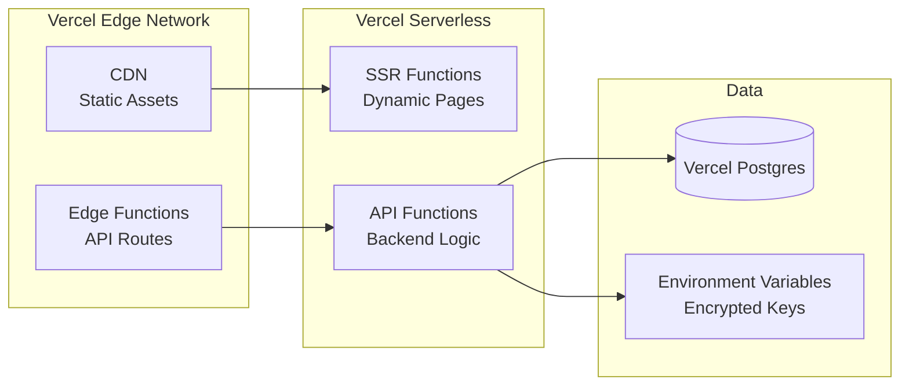
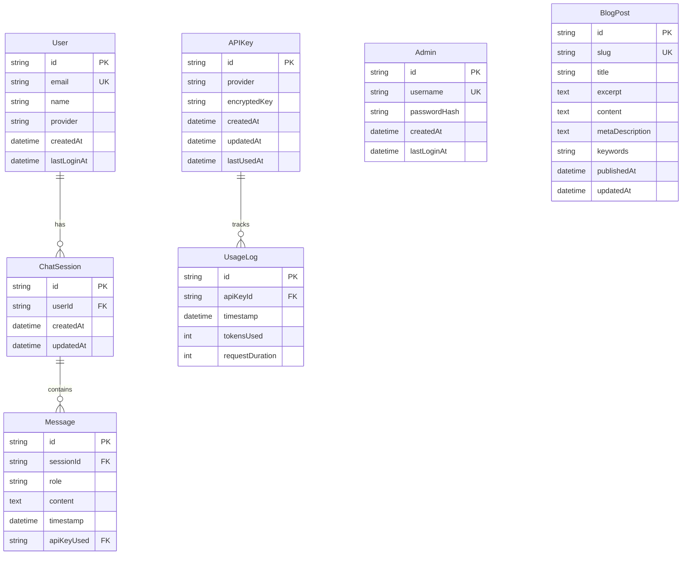

# Design Document: AI FutureLinks Platform

## Overview

The AI FutureLinks Platform is a Next.js-based web application that serves as a model-agnostic AI interaction workspace. The platform acts as a secure proxy layer between end users and multiple AI providers (OpenAI, Google Gemini, Anthropic), enabling seamless multi-model switching without requiring users to manage their own API keys.

The architecture consists of three primary layers:

1. **Public Layer**: Landing page, blog system, and authenticated chat interface for end users
2. **Admin Layer**: Secure dashboard for API key management, usage tracking, and platform configuration
3. **Proxy Layer**: Serverless functions that route authenticated requests to external AI providers

The platform is optimized for Vercel deployment, leveraging serverless functions, edge runtime capabilities, and Vercel Postgres for data persistence. All sensitive data (API keys, credentials) is encrypted at rest and transmitted over HTTPS.

Key design principles:
- **Security-first**: Encrypted storage, secure session management, HTTPS-only communication
- **Performance**: SSR for SEO, static generation for blog content, streaming AI responses
- **Scalability**: Serverless architecture with automatic scaling via Vercel
- **Maintainability**: Clear separation of concerns between public, admin, and proxy layers

## Architecture

### System Architecture Diagram

```mermaid
graph TB
    subgraph "Client Layer"
        Browser[Web Browser]
    end
    
    subgraph "Vercel Platform"
        subgraph "Next.js Application"
            Landing[Landing Page<br/>SSR]
            Blog[Blog System<br/>SSG]
            Chat[Chat Interface<br/>CSR + SSR]
            AdminUI[Admin Dashboard<br/>CSR]
        end
        
        subgraph "API Routes / Serverless Functions"
            AuthAPI[/api/auth/*<br/>NextAuth.js]
            ProxyAPI[/api/proxy<br/>AI Request Handler]
            AdminAPI[/api/admin/*<br/>Admin Operations]
            BlogAPI[/api/blog/*<br/>Blog Management]
        end
        
        subgraph "Data Layer"
            DB[(Vercel Postgres)]
        end
    end
    
    subgraph "External Services"
        Google[Google OAuth]
        OpenAI[OpenAI API]
        Gemini[Google Gemini API]
        Anthropic[Anthropic API]
    end
    
    Browser -->|HTTPS| Landing
    Browser -->|HTTPS| Blog
    Browser -->|HTTPS| Chat
    Browser -->|HTTPS| AdminUI
    
    Landing --> AuthAPI
    Chat --> AuthAPI
    Chat --> ProxyAPI
    AdminUI --> AdminAPI
    
    AuthAPI -->|OAuth| Google
    ProxyAPI -->|API Requests| OpenAI
    ProxyAPI -->|API Requests| Gemini
    ProxyAPI -->|API Requests| Anthropic
    
    AuthAPI -.->|Read/Write| DB
    ProxyAPI -.->|Log Usage| DB
    AdminAPI -.->|CRUD| DB
    BlogAPI -.->|Read| DB
```

### Technology Stack

**Frontend Framework**
- Next.js 14+ with App Router for modern React patterns
- React Server Components for optimal performance
- TypeScript for type safety

**Styling**
- Tailwind CSS for responsive design system
- CSS Modules for component-scoped styles
- Responsive breakpoints: mobile (<768px), tablet (768-1024px), desktop (>1024px)

**Authentication**
- NextAuth.js v5 for unified authentication
- Providers: Google OAuth, Email (magic links)
- Separate admin authentication with credential provider
- JWT-based session management

**Database**
- Vercel Postgres (PostgreSQL-compatible)
- Prisma ORM for type-safe database access
- Connection pooling via Vercel's built-in support

**API Proxy Layer**
- Next.js API routes as serverless functions
- Streaming support for real-time AI responses
- Request/response middleware for usage tracking

**Deployment**
- Vercel platform with automatic CI/CD
- Edge functions for low-latency API routes
- CDN for static assets and blog content

### Deployment Architecture



### Core Web Vitals Optimization Strategy

**Largest Contentful Paint (LCP) - Target: <2.5s**

Implementation approach:
- Use Next.js Image component with priority prop for above-the-fold images
- Implement server-side rendering for landing page to deliver initial HTML quickly
- Preload critical fonts using `<link rel="preload">`
- Optimize hero section images with WebP/AVIF formats
- Use CDN caching for static assets via Vercel Edge Network
- Minimize render-blocking resources by inlining critical CSS

```typescript
// Example: Priority image loading
import Image from 'next/image';

<Image
  src="/hero-image.png"
  alt="AI FutureLinks Platform"
  width={1200}
  height={630}
  priority // Preload this image
  placeholder="blur"
/>
```

**First Input Delay (FID) - Target: <100ms**

Implementation approach:
- Code splitting with Next.js dynamic imports for non-critical components
- Defer non-essential JavaScript execution
- Use React Server Components to reduce client-side JavaScript
- Implement progressive enhancement for interactive features
- Minimize main thread work during page load

```typescript
// Example: Dynamic import for chat interface
import dynamic from 'next/dynamic';

const ChatInterface = dynamic(() => import('@/components/ChatInterface'), {
  loading: () => <ChatSkeleton />,
  ssr: false // Client-side only
});
```

**Cumulative Layout Shift (CLS) - Target: <0.1**

Implementation approach:
- Specify width and height attributes for all images
- Reserve space for dynamic content with skeleton loaders
- Use CSS aspect-ratio for responsive images
- Avoid inserting content above existing content
- Use font-display: swap with fallback fonts matching dimensions

```typescript
// Example: Skeleton loader to prevent layout shift
function ChatSkeleton() {
  return (
    <div className="h-screen flex flex-col">
      <div className="h-16 bg-gray-200 animate-pulse" />
      <div className="flex-1 space-y-4 p-4">
        {[1, 2, 3].map(i => (
          <div key={i} className="h-20 bg-gray-200 animate-pulse rounded" />
        ))}
      </div>
    </div>
  );
}
```

**Font Optimization**

```css
/* Tailwind config for font optimization */
@font-face {
  font-family: 'Inter';
  font-style: normal;
  font-weight: 400;
  font-display: swap; /* Prevent invisible text */
  src: url('/fonts/inter-var.woff2') format('woff2');
}
```

**Resource Hints**

```typescript
// In app/layout.tsx
export default function RootLayout({ children }) {
  return (
    <html lang="en">
      <head>
        <link rel="preconnect" href="https://fonts.googleapis.com" />
        <link rel="dns-prefetch" href="https://api.openai.com" />
        <link rel="preload" href="/fonts/inter-var.woff2" as="font" type="font/woff2" crossOrigin="anonymous" />
      </head>
      <body>{children}</body>
    </html>
  );
}
```

## Components and Interfaces

### Public-Facing Components

#### 1. Landing Page Component (`app/page.tsx`)

**Purpose**: SEO-optimized homepage with hero section and navigation

**Props**: None (server component)

**Key Features**:
- Server-side rendered for optimal SEO
- Semantic HTML with proper heading hierarchy
- Call-to-action button to chat interface
- Navigation to blog and authentication

**SEO Requirements**:
- H1: "The Evolution of the Interface"
- H2: Subheadline with key messaging
- Meta tags with target keywords
- Open Graph tags for social sharing

#### 2. Authentication Components

**SignIn Component** (`components/auth/SignIn.tsx`)
- Google OAuth button
- Email authentication form
- Error state handling
- Redirect logic post-authentication

**AuthProvider** (`components/auth/AuthProvider.tsx`)
- NextAuth.js session provider wrapper
- Client-side session state management

#### 3. Chat Interface (`app/chat/page.tsx`)

**Purpose**: Main AI interaction interface for authenticated users

**State Management**:
```typescript
interface ChatState {
  messages: Message[];
  isLoading: boolean;
  error: string | null;
  selectedModel: string;
}

interface Message {
  id: string;
  role: 'user' | 'assistant';
  content: string;
  timestamp: Date;
}
```

**Key Features**:
- Message history display with auto-scroll
- Multi-line text input with send button
- Streaming response support
- Error handling and retry logic
- Model selection dropdown (future enhancement)

**API Integration**:
- POST to `/api/proxy` with user message
- Server-sent events for streaming responses
- Automatic session validation

#### 4. Blog System

**BlogList Component** (`app/blog/page.tsx`)
- Static generation at build time
- Pagination support (10 posts per page)
- Post excerpts with "Read More" links

**BlogPost Component** (`app/blog/[slug]/page.tsx`)
- Static generation with dynamic routes
- Full markdown rendering
- SEO meta tags per post
- Social sharing buttons

**Data Structure**:
```typescript
interface BlogPost {
  id: string;
  slug: string;
  title: string;
  excerpt: string;
  content: string; // Markdown
  publishedAt: Date;
  metaDescription: string;
  keywords: string[];
}
```

#### 5. Structured Data Components

**Purpose**: Embed Schema.org JSON-LD structured data for search engines and AI crawlers

**JsonLd Component** (`components/seo/JsonLd.tsx`)

```typescript
interface JsonLdProps {
  data: Record<string, any>;
}

// Renders JSON-LD script tag in head
function JsonLd({ data }: JsonLdProps) {
  return (
    <script
      type="application/ld+json"
      dangerouslySetInnerHTML={{ __html: JSON.stringify(data) }}
    />
  );
}
```

**OrganizationSchema** (`lib/seo/schemas.ts`)

```typescript
function generateOrganizationSchema() {
  return {
    "@context": "https://schema.org",
    "@type": "Organization",
    name: "AI FutureLinks",
    url: "https://ai.futurelinks.art",
    logo: "https://ai.futurelinks.art/logo.png",
    description: "Model-agnostic AI workspace for the 2026 workflow"
  };
}
```

**WebSiteSchema** (`lib/seo/schemas.ts`)

```typescript
function generateWebSiteSchema() {
  return {
    "@context": "https://schema.org",
    "@type": "WebSite",
    name: "AI FutureLinks",
    url: "https://ai.futurelinks.art",
    potentialAction: {
      "@type": "SearchAction",
      target: "https://ai.futurelinks.art/search?q={search_term_string}",
      "query-input": "required name=search_term_string"
    }
  };
}
```

**BlogPostingSchema** (`lib/seo/schemas.ts`)

```typescript
function generateBlogPostingSchema(post: BlogPost) {
  return {
    "@context": "https://schema.org",
    "@type": "BlogPosting",
    headline: post.title,
    author: {
      "@type": "Person",
      name: "AI FutureLinks Team"
    },
    datePublished: post.publishedAt.toISOString(),
    dateModified: post.updatedAt.toISOString(),
    image: post.featuredImage || "https://ai.futurelinks.art/default-blog-image.png",
    articleBody: post.content,
    publisher: {
      "@type": "Organization",
      name: "AI FutureLinks",
      logo: {
        "@type": "ImageObject",
        url: "https://ai.futurelinks.art/logo.png"
      }
    }
  };
}
```

**BreadcrumbListSchema** (`lib/seo/schemas.ts`)

```typescript
function generateBreadcrumbSchema(slug: string, title: string) {
  return {
    "@context": "https://schema.org",
    "@type": "BreadcrumbList",
    itemListElement: [
      {
        "@type": "ListItem",
        position: 1,
        name: "Home",
        item: "https://ai.futurelinks.art"
      },
      {
        "@type": "ListItem",
        position: 2,
        name: "Blog",
        item: "https://ai.futurelinks.art/blog"
      },
      {
        "@type": "ListItem",
        position: 3,
        name: title,
        item: `https://ai.futurelinks.art/blog/${slug}`
      }
    ]
  };
}
```

**FAQPageSchema** (`lib/seo/schemas.ts`)

```typescript
interface FAQItem {
  question: string;
  answer: string;
}

function generateFAQPageSchema(faqs: FAQItem[]) {
  return {
    "@context": "https://schema.org",
    "@type": "FAQPage",
    mainEntity: faqs.map(faq => ({
      "@type": "Question",
      name: faq.question,
      acceptedAnswer: {
        "@type": "Answer",
        text: faq.answer
      }
    }))
  };
}
```

#### 6. SEO Utilities

**Purpose**: Helper functions for generating SEO meta tags and optimizing content

**MetaTagGenerator** (`lib/seo/meta-tags.ts`)

```typescript
interface MetaTagsConfig {
  title: string;
  description: string;
  keywords?: string[];
  ogImage?: string;
  canonicalUrl: string;
  type?: 'website' | 'article';
}

function generateMetaTags(config: MetaTagsConfig) {
  return {
    title: config.title,
    description: config.description,
    keywords: config.keywords?.join(', '),
    openGraph: {
      title: config.title,
      description: config.description,
      url: config.canonicalUrl,
      type: config.type || 'website',
      images: [
        {
          url: config.ogImage || 'https://ai.futurelinks.art/og-default.png',
          width: 1200,
          height: 630,
          alt: config.title
        }
      ]
    },
    twitter: {
      card: 'summary_large_image',
      title: config.title,
      description: config.description,
      images: [config.ogImage || 'https://ai.futurelinks.art/og-default.png']
    },
    alternates: {
      canonical: config.canonicalUrl
    }
  };
}
```

**RobotsConfig** (`app/robots.ts`)

```typescript
export default function robots() {
  return {
    rules: [
      {
        userAgent: '*',
        allow: '/',
        disallow: ['/admin/', '/api/admin/']
      },
      {
        userAgent: 'GPTBot',
        allow: '/',
        disallow: ['/admin/', '/api/']
      },
      {
        userAgent: 'Google-Extended',
        allow: '/',
        disallow: ['/admin/', '/api/']
      },
      {
        userAgent: 'ClaudeBot',
        allow: '/',
        disallow: ['/admin/', '/api/']
      },
      {
        userAgent: 'CCBot',
        allow: '/',
        disallow: ['/admin/', '/api/']
      },
      {
        userAgent: 'anthropic-ai',
        allow: '/',
        disallow: ['/admin/', '/api/']
      }
    ],
    sitemap: 'https://ai.futurelinks.art/sitemap.xml'
  };
}
```

**SitemapGenerator** (`app/sitemap.ts`)

```typescript
export default async function sitemap() {
  const posts = await prisma.blogPost.findMany({
    select: { slug: true, updatedAt: true }
  });

  const blogUrls = posts.map(post => ({
    url: `https://ai.futurelinks.art/blog/${post.slug}`,
    lastModified: post.updatedAt,
    changeFrequency: 'weekly' as const,
    priority: 0.8
  }));

  return [
    {
      url: 'https://ai.futurelinks.art',
      lastModified: new Date(),
      changeFrequency: 'daily' as const,
      priority: 1.0
    },
    {
      url: 'https://ai.futurelinks.art/blog',
      lastModified: new Date(),
      changeFrequency: 'daily' as const,
      priority: 0.9
    },
    ...blogUrls
  ];
}
```

**ImageOptimization** (`next.config.js`)

```javascript
module.exports = {
  images: {
    formats: ['image/avif', 'image/webp'],
    deviceSizes: [640, 750, 828, 1080, 1200, 1920, 2048, 3840],
    imageSizes: [16, 32, 48, 64, 96, 128, 256, 384],
    minimumCacheTTL: 60,
    dangerouslyAllowSVG: true,
    contentSecurityPolicy: "default-src 'self'; script-src 'none'; sandbox;"
  }
};
```

### Admin Dashboard Components

#### 1. Admin Authentication (`app/admin/login/page.tsx`)

**Purpose**: Separate login interface for administrators

**Features**:
- Username/password form
- Secure credential validation
- Session creation with 30-minute timeout
- Error messaging

#### 2. API Key Management (`app/admin/keys/page.tsx`)

**Purpose**: CRUD interface for API key management

**State Management**:
```typescript
interface APIKey {
  id: string;
  provider: string; // 'openai' | 'gemini' | 'anthropic'
  keyValue: string; // Encrypted in DB
  createdAt: Date;
  updatedAt: Date;
  lastUsed: Date | null;
}

interface APIKeyFormState {
  provider: string;
  keyValue: string;
  isEditing: boolean;
  editingId: string | null;
}
```

**Features**:
- List view of all API keys (masked display)
- Add new key form
- Edit existing key modal
- Delete with confirmation dialog
- Real-time validation

#### 3. Usage Dashboard (`app/admin/usage/page.tsx`)

**Purpose**: Display usage metrics for all API keys

**Data Structure**:
```typescript
interface UsageMetrics {
  apiKeyId: string;
  provider: string;
  totalRequests: number;
  lastRequestAt: Date | null;
  requestsByDay: { date: string; count: number }[];
}
```

**Features**:
- Table view with sortable columns
- Date range filtering
- Export to CSV functionality
- Real-time updates (polling every 5 seconds)

#### 4. Admin Management (`app/admin/admins/page.tsx`)

**Purpose**: Manage administrator accounts

**Features**:
- List of admin accounts
- Create new admin form
- Password change interface
- Username uniqueness validation
- Password strength requirements (min 8 chars)

### API Routes and Serverless Functions

#### 1. Authentication API (`/api/auth/[...nextauth]`)

**Provider**: NextAuth.js

**Configuration**:
```typescript
// Pseudo-code structure
{
  providers: [
    GoogleProvider({
      clientId: process.env.GOOGLE_CLIENT_ID,
      clientSecret: process.env.GOOGLE_CLIENT_SECRET,
    }),
    EmailProvider({
      server: process.env.EMAIL_SERVER,
      from: process.env.EMAIL_FROM,
    }),
    CredentialsProvider({ // Admin only
      name: 'Admin',
      credentials: { username, password },
      authorize: async (credentials) => {
        // Validate against admin table
      }
    })
  ],
  session: {
    strategy: 'jwt',
    maxAge: 30 * 60, // 30 minutes for admin
  },
  callbacks: {
    jwt: async ({ token, user }) => {
      // Add user role (public/admin)
    },
    session: async ({ session, token }) => {
      // Attach role to session
    }
  }
}
```

#### 2. AI Proxy API (`/api/proxy`)

**Method**: POST

**Request Body**:
```typescript
interface ProxyRequest {
  message: string;
  conversationHistory?: Message[];
  model?: string; // Optional model selection
}
```

**Response**: Server-Sent Events stream

**Processing Flow**:
1. Validate user session (NextAuth)
2. Select available API key from database
3. Transform request to provider-specific format
4. Forward to external AI provider
5. Stream response back to client
6. Log usage metrics to database

**Error Handling**:
- 401: Unauthorized (no valid session)
- 500: API provider error
- 503: No available API keys

#### 3. Admin API Routes

**`/api/admin/keys`**
- GET: List all API keys
- POST: Create new API key
- PUT: Update existing API key
- DELETE: Remove API key

**`/api/admin/usage`**
- GET: Retrieve usage metrics with optional filters

**`/api/admin/admins`**
- GET: List admin accounts
- POST: Create new admin
- PUT: Update admin password

**Middleware**: All admin routes validate admin session before processing

#### 4. Blog API (`/api/blog`)

**`/api/blog/posts`**
- GET: List published posts with pagination

**`/api/blog/posts/[slug]`**
- GET: Retrieve single post by slug

## Data Models

### Database Schema



### Prisma Schema

```prisma
model User {
  id          String        @id @default(cuid())
  email       String        @unique
  name        String?
  provider    String        // 'google' | 'email'
  createdAt   DateTime      @default(now())
  lastLoginAt DateTime      @default(now())
  sessions    ChatSession[]
}

model ChatSession {
  id        String    @id @default(cuid())
  userId    String
  user      User      @relation(fields: [userId], references: [id], onDelete: Cascade)
  messages  Message[]
  createdAt DateTime  @default(now())
  updatedAt DateTime  @updatedAt
}

model Message {
  id          String      @id @default(cuid())
  sessionId   String
  session     ChatSession @relation(fields: [sessionId], references: [id], onDelete: Cascade)
  role        String      // 'user' | 'assistant'
  content     String      @db.Text
  timestamp   DateTime    @default(now())
  apiKeyUsed  String?
  apiKey      APIKey?     @relation(fields: [apiKeyUsed], references: [id])
}

model APIKey {
  id           String      @id @default(cuid())
  provider     String      // 'openai' | 'gemini' | 'anthropic'
  encryptedKey String      @db.Text
  createdAt    DateTime    @default(now())
  updatedAt    DateTime    @updatedAt
  lastUsedAt   DateTime?
  usageLogs    UsageLog[]
  messages     Message[]
}

model UsageLog {
  id              String   @id @default(cuid())
  apiKeyId        String
  apiKey          APIKey   @relation(fields: [apiKeyId], references: [id], onDelete: Cascade)
  timestamp       DateTime @default(now())
  tokensUsed      Int?
  requestDuration Int      // milliseconds
}

model Admin {
  id           String   @id @default(cuid())
  username     String   @unique
  passwordHash String
  createdAt    DateTime @default(now())
  lastLoginAt  DateTime @default(now())
}

model BlogPost {
  id              String   @id @default(cuid())
  slug            String   @unique
  title           String
  excerpt         String   @db.Text
  content         String   @db.Text
  metaDescription String   @db.Text
  keywords        String   // JSON array as string
  author          String   @default("AI FutureLinks Team")
  featuredImage   String?  // URL to featured image
  publishedAt     DateTime
  updatedAt       DateTime @updatedAt
}
```

### Encryption Strategy

**API Key Encryption**:
- Algorithm: AES-256-GCM
- Key derivation: Environment variable `ENCRYPTION_KEY`
- Implementation: Node.js `crypto` module

```typescript
// Pseudo-code
function encryptAPIKey(plaintext: string): string {
  const iv = crypto.randomBytes(16);
  const cipher = crypto.createCipheriv('aes-256-gcm', ENCRYPTION_KEY, iv);
  const encrypted = Buffer.concat([cipher.update(plaintext, 'utf8'), cipher.final()]);
  const authTag = cipher.getAuthTag();
  return `${iv.toString('hex')}:${encrypted.toString('hex')}:${authTag.toString('hex')}`;
}

function decryptAPIKey(ciphertext: string): string {
  const [ivHex, encryptedHex, authTagHex] = ciphertext.split(':');
  const decipher = crypto.createDecipheriv('aes-256-gcm', ENCRYPTION_KEY, Buffer.from(ivHex, 'hex'));
  decipher.setAuthTag(Buffer.from(authTagHex, 'hex'));
  return decipher.update(Buffer.from(encryptedHex, 'hex')) + decipher.final('utf8');
}
```

**Password Hashing**:
- Algorithm: bcrypt
- Salt rounds: 12
- Library: `bcryptjs`

### Environment Variables

```bash
# Database
DATABASE_URL="postgresql://..."

# Authentication
NEXTAUTH_URL="https://ai.futurelinks.art"
NEXTAUTH_SECRET="<random-secret>"
GOOGLE_CLIENT_ID="<google-oauth-client-id>"
GOOGLE_CLIENT_SECRET="<google-oauth-client-secret>"

# Email Provider (optional)
EMAIL_SERVER="smtp://..."
EMAIL_FROM="noreply@futurelinks.art"

# Encryption
ENCRYPTION_KEY="<32-byte-hex-string>"

# Admin (initial setup)
INITIAL_ADMIN_USERNAME="admin"
INITIAL_ADMIN_PASSWORD="<secure-password>"
```


## Correctness Properties

*A property is a characteristic or behavior that should hold true across all valid executions of a system—essentially, a formal statement about what the system should do. Properties serve as the bridge between human-readable specifications and machine-verifiable correctness guarantees.*

### Property Reflection

After analyzing all acceptance criteria, I identified several areas where properties can be consolidated:

**Authentication & Session Management**: Multiple criteria test session creation, validation, and termination. These can be grouped into comprehensive properties about session lifecycle.

**API Key CRUD Operations**: Add, update, delete operations all follow similar patterns (validation, persistence, confirmation). These can be unified into properties about state transitions.

**Usage Tracking**: Multiple criteria test usage metric collection and display. These can be combined into properties about metric consistency.

**UI Element Presence**: Many criteria test that specific UI elements exist. These are concrete examples rather than properties and should be tested as unit tests.

**Validation Rules**: Multiple criteria test input validation (empty fields, password length, etc.). These can be grouped by validation type.

### Property 1: Successful Authentication Creates Session

*For any* valid user credentials (Google OAuth or email), successful authentication should create a User_Session and redirect to the Chat_Interface.

**Validates: Requirements 2.3, 2.4**

### Property 2: Failed Authentication Shows Error

*For any* invalid authentication attempt, the platform should display an error message and allow retry without creating a session.

**Validates: Requirements 2.5**

### Property 3: Logout Terminates Session

*For any* active User_Session, performing logout should terminate the session and revoke access to authenticated features.

**Validates: Requirements 2.7**

### Property 4: Active Session Grants Chat Access

*For any* active User_Session, the platform should provide access to the Chat_Interface without requiring re-authentication.

**Validates: Requirements 3.1**

### Property 5: Unauthenticated Chat Access Redirects

*For any* attempt to access the Chat_Interface without an active User_Session, the platform should redirect to the authentication page.

**Validates: Requirements 3.5**

### Property 6: Message Submission Creates Proxy Request

*For any* message submitted in the Chat_Interface with an active session, the platform should create a Proxy_Request to an external API provider.

**Validates: Requirements 4.1**

### Property 7: Proxy Request Selects API Key

*For any* Proxy_Request, the platform should select an available API_Key from the Credential_Store before forwarding the request.

**Validates: Requirements 4.2, 4.3**

### Property 8: API Response Display

*For any* successful API provider response, the platform should display the response content in the Chat_Interface conversation history.

**Validates: Requirements 4.4**

### Property 9: API Failure Error Handling

*For any* failed API provider request, the platform should display an error message to the user without crashing the interface.

**Validates: Requirements 4.5**

### Property 10: Usage Metrics Recorded Per Request

*For any* Proxy_Request processed, the platform should record Usage_Metric data including API key used, timestamp, and request details.

**Validates: Requirements 4.7, 11.1**

### Property 11: Blog Post Display Completeness

*For any* published blog post, when displayed in the list view, it should include title and excerpt; when displayed individually, it should include full content.

**Validates: Requirements 5.2, 5.3**

### Property 12: Blog Post SEO Meta Tags

*For any* blog post page, the rendered HTML should include SEO meta tags for title, description, and keywords.

**Validates: Requirements 5.4**

### Property 13: Blog Post Semantic HTML

*For any* blog post, the rendered HTML should use semantic elements (article, header, section) and proper heading hierarchy.

**Validates: Requirements 5.5**

### Property 14: Blog Pagination Threshold

*For any* blog post list with more than 10 published posts, the platform should display pagination controls.

**Validates: Requirements 5.6**

### Property 15: Public Page HTML Validity

*For any* public-facing page (landing, blog, chat), the rendered HTML should be valid HTML5 with semantic markup.

**Validates: Requirements 6.1**

### Property 16: Meta Description Presence

*For any* landing page or blog post, the HTML head should contain a meta description tag.

**Validates: Requirements 6.2**

### Property 17: Open Graph Tags

*For any* shareable page, the HTML head should contain Open Graph tags for social media sharing (og:title, og:description, og:image).

**Validates: Requirements 6.3**

### Property 18: Descriptive Blog URLs

*For any* blog post, the URL should be slug-based and descriptive (e.g., /blog/ai-workspace-guide) rather than ID-based.

**Validates: Requirements 6.6**

### Property 19: Heading Hierarchy Correctness

*For any* page, the heading elements should follow proper hierarchy (single h1, h2 under h1, h3 under h2, etc.) without skipping levels.

**Validates: Requirements 6.7, 1.6**

### Property 20: Admin Authentication Creates Admin Session

*For any* valid admin credentials, successful authentication should create an Admin_Session with access to all admin features.

**Validates: Requirements 7.3, 7.5**

### Property 21: Invalid Admin Credentials Rejected

*For any* invalid admin credentials, the login attempt should be rejected with an error message and no session created.

**Validates: Requirements 7.4**

### Property 22: Admin Session Termination Revokes Access

*For any* Admin_Session that expires or is logged out, access to Admin_Dashboard features should be revoked.

**Validates: Requirements 7.6**

### Property 23: API Key Addition Validation

*For any* API key addition attempt, if the provider name or credential string is empty, the operation should be rejected with a validation error.

**Validates: Requirements 8.2, 8.3, 8.6**

### Property 24: API Key Addition Persistence

*For any* valid API key addition, the key should be stored in the Credential_Store with encryption and a confirmation message displayed.

**Validates: Requirements 8.4, 8.5**

### Property 25: API Key List Display

*For any* authenticated Admin_Session, the Admin_Dashboard should display a list of all stored API_Key entries.

**Validates: Requirements 9.1**

### Property 26: API Key Selection Shows Details

*For any* API_Key selected for editing, the Admin_Dashboard should display its current provider name and credential string (masked).

**Validates: Requirements 9.2**

### Property 27: API Key Update Persistence

*For any* API key update with valid data, the changes should be persisted to the Credential_Store and a confirmation message displayed.

**Validates: Requirements 9.5, 9.6**

### Property 28: API Key Encryption at Rest

*For any* API key stored in the Credential_Store, the credential string should be encrypted (stored value differs from plaintext).

**Validates: Requirements 10.2**

### Property 29: Storage Failure Error Handling

*For any* failed storage operation (add, update, delete), the Admin_Dashboard should display an error message and retain the previous state without data loss.

**Validates: Requirements 10.3**

### Property 30: API Key Retrieval Round Trip

*For any* set of API keys stored in the Credential_Store, reloading the Admin_Dashboard should retrieve all keys with their correct provider names and decrypted credentials.

**Validates: Requirements 10.4, 10.5**

### Property 31: Usage Metrics Display

*For any* API_Key with recorded usage, the Admin_Dashboard should display the total request count and last used timestamp.

**Validates: Requirements 11.2, 11.3, 11.4**

### Property 32: Admin Account Creation Uniqueness

*For any* admin account creation attempt with a username that already exists, the operation should be rejected with a validation error.

**Validates: Requirements 12.3**

### Property 33: Password Strength Validation

*For any* admin account creation or password change, if the password is less than 8 characters, the operation should be rejected with a validation error.

**Validates: Requirements 12.4, 12.7**

### Property 34: Password Hashing at Rest

*For any* admin password stored in the database, the stored value should be hashed (not plaintext) using bcrypt or equivalent.

**Validates: Requirements 12.6**

### Property 35: Secure Headers Present

*For any* HTTP response from the platform, security headers (Content-Security-Policy, X-Frame-Options, X-Content-Type-Options) should be present.

**Validates: Requirements 13.7**

### Property 36: Admin Session Timeout

*For any* Admin_Session inactive for 30 minutes, the session should be automatically terminated, triggering a redirect to login with a timeout notification.

**Validates: Requirements 14.1, 14.2, 14.3**

### Property 37: Admin Session Activity Extension

*For any* user interaction during an active Admin_Session, the session timeout period should be reset to 30 minutes from that interaction.

**Validates: Requirements 14.4**

### Property 38: Admin Session Token Validation

*For any* request to an admin endpoint, the platform should validate the session token and reject requests with invalid or expired tokens.

**Validates: Requirements 14.5**

### Property 39: API Key Deletion Confirmation

*For any* API key deletion initiation, a confirmation prompt should be displayed before the deletion is executed.

**Validates: Requirements 15.2**

### Property 40: API Key Deletion Cascade

*For any* confirmed API key deletion, both the API_Key entry and all associated Usage_Metric data should be removed from the database, with a confirmation message displayed.

**Validates: Requirements 15.3, 15.4, 15.5**

### Property 41: Mobile Touch Target Sizing

*For any* interactive element in the Chat_Interface on mobile devices (width < 768px), the touch target should be at least 44x44 pixels for usability.

**Validates: Requirements 16.6**

### Property 42: SEO Keyword Presence

*For any* subset of the defined SEO keywords, those keywords should appear in the Landing_Page content.

**Validates: Requirements 1.5**

### Property 43: JSON-LD Schema Validity

*For any* public page with JSON-LD structured data, the JSON-LD should be valid JSON and conform to Schema.org specifications.

**Validates: Requirements 18.1, 18.7**

### Property 44: Blog Post Schema Completeness

*For any* blog post page, the BlogPosting JSON-LD schema should include all required properties: headline, author, datePublished, dateModified, image, and articleBody.

**Validates: Requirements 18.4**

### Property 45: JSON-LD Head Placement

*For any* page with JSON-LD structured data, the script tags should be embedded in the HTML head section.

**Validates: Requirements 18.8**

### Property 46: Breadcrumb Schema Presence

*For any* blog post page, the page should include BreadcrumbList JSON-LD schema showing navigation hierarchy from home to blog to post.

**Validates: Requirements 18.6**

### Property 47: FAQ Schema Structure

*For any* FAQ page, the FAQPage JSON-LD schema should include mainEntity with question-answer pairs for each FAQ item.

**Validates: Requirements 18.5**

### Property 48: AI Crawler Robots Access

*For any* AI crawler user-agent (GPTBot, Google-Extended, ClaudeBot, CCBot, anthropic-ai), the robots.txt should include an allow directive for public content.

**Validates: Requirements 19.1, 19.2, 19.3, 19.4, 19.5, 19.7**

### Property 49: Canonical URL Presence

*For any* public page, the HTML head should include a canonical URL link tag pointing to the authoritative version of the page.

**Validates: Requirements 19.8, 6.12**

### Property 50: Blog Heading Hierarchy

*For any* blog post, the content should use hierarchical headings (h2, h3, h4) without skipping levels.

**Validates: Requirements 20.1**

### Property 51: Image Alt Text Presence

*For any* image element on public pages, the img tag should include a non-empty alt attribute.

**Validates: Requirements 20.2, 6.13**

### Property 52: Blog Semantic HTML

*For any* blog post page, the post content should be wrapped in an HTML5 article element.

**Validates: Requirements 20.3**

### Property 53: Section Semantic HTML

*For any* page with distinct content sections, those sections should use HTML5 section elements.

**Validates: Requirements 20.4**

### Property 54: FAQ Structure

*For any* FAQ content, each question should be in a heading element followed by answer paragraph(s).

**Validates: Requirements 20.6**

### Property 55: Core Web Vitals - FID Threshold

*For any* public page, the First Input Delay (FID) should be less than 100 milliseconds when measured.

**Validates: Requirements 21.2**

### Property 56: Core Web Vitals - CLS Threshold

*For any* public page, the Cumulative Layout Shift (CLS) score should be less than 0.1 when measured.

**Validates: Requirements 21.3**

### Property 57: Lazy Loading Below Fold

*For any* image positioned below the fold, the img or Image component should include lazy loading attributes.

**Validates: Requirements 21.4**

### Property 58: Font Display Swap

*For any* web font declaration, the CSS should include font-display: swap to prevent invisible text.

**Validates: Requirements 21.6**

### Property 59: Resource Hints for Critical Assets

*For any* page with critical external resources, the HTML head should include appropriate resource hints (preconnect, prefetch, or preload).

**Validates: Requirements 21.8**

### Property 60: Modern Image Formats

*For any* image served by the platform, it should be available in modern formats (WebP or AVIF) with fallbacks for older browsers.

**Validates: Requirements 21.9**

### Property 61: Mobile-First CSS

*For any* stylesheet, the base styles should target mobile viewports with media queries for larger screens, not vice versa.

**Validates: Requirements 22.1**

### Property 62: Mobile Page Load Time

*For any* public page, the page load time on simulated 4G mobile connection should be less than 2 seconds.

**Validates: Requirements 22.2**

### Property 63: Viewport Meta Tag

*For any* public page, the HTML head should include a viewport meta tag with appropriate width and initial-scale settings.

**Validates: Requirements 22.3**

### Property 64: Mobile Touch Target Size

*For any* interactive element on mobile viewports, the touch target should be at least 44x44 pixels.

**Validates: Requirements 22.4, 16.6**

### Property 65: No Horizontal Scroll on Mobile

*For any* page rendered on mobile viewport (width < 768px), the page should not cause horizontal scrolling.

**Validates: Requirements 22.5**

### Property 66: Mobile Font Size

*For any* page, the base font size should be at least 16px for mobile readability.

**Validates: Requirements 22.6**

### Property 67: Blog Post Structure

*For any* blog post, the content should include identifiable introduction, body sections, and conclusion.

**Validates: Requirements 23.1**

### Property 68: Blog Author Metadata

*For any* blog post, the post should include author attribution in both the BlogPosting schema and visible content.

**Validates: Requirements 23.2**

### Property 69: Blog Date Metadata

*For any* blog post, the post should include both publication date and last modified date in the BlogPosting schema.

**Validates: Requirements 23.3**

### Property 70: Definition List Markup

*For any* content containing term definitions, the HTML should use definition list elements (dl, dt, dd).

**Validates: Requirements 23.5**

### Property 71: Code Block Formatting

*For any* code example in blog content, the code should be in a properly formatted code block with language specification.

**Validates: Requirements 23.6**

### Property 72: Comparison Table Structure

*For any* comparison content, the information should be structured using HTML table elements with descriptive headers.

**Validates: Requirements 23.7**

### Property 73: Blockquote Citation

*For any* quoted content, the HTML should use blockquote elements with proper citation attributes.

**Validates: Requirements 23.8**

## Error Handling

### Error Categories

**1. Authentication Errors**
- Invalid credentials (user or admin)
- Expired sessions
- OAuth provider failures

**Strategy**: Display user-friendly error messages, preserve form state, allow retry without page reload.

**2. API Proxy Errors**
- External API provider unavailable
- API key invalid or rate-limited
- Network timeouts
- Malformed responses

**Strategy**: Catch all errors in proxy middleware, log for admin review, display generic error to user ("Unable to process request, please try again"), implement exponential backoff for retries.

**3. Database Errors**
- Connection failures
- Query timeouts
- Constraint violations (unique username, etc.)

**Strategy**: Use Prisma error handling, implement transaction rollbacks, display specific validation errors to users, log technical details for debugging.

**4. Validation Errors**
- Empty required fields
- Invalid formats (email, password length)
- Duplicate entries

**Strategy**: Client-side validation for immediate feedback, server-side validation for security, display field-specific error messages.

**5. Authorization Errors**
- Accessing admin routes without admin session
- Accessing chat without user session
- CSRF token validation failures

**Strategy**: Middleware-based route protection, automatic redirects to appropriate login pages, clear error messages about required permissions.

### Error Response Format

All API routes should return consistent error responses:

```typescript
interface ErrorResponse {
  error: {
    code: string; // Machine-readable error code
    message: string; // User-friendly message
    details?: any; // Optional technical details (dev mode only)
  };
  timestamp: string;
}
```

### Error Logging

**Client-Side**: Use console.error for development, integrate error tracking service (e.g., Sentry) for production

**Server-Side**: 
- Log all errors with context (user ID, request ID, timestamp)
- Use structured logging (JSON format)
- Separate log levels: ERROR (requires action), WARN (monitor), INFO (audit trail)

### Graceful Degradation

**Blog System**: If database is unavailable, serve cached static pages

**Chat Interface**: If all API keys are exhausted, display maintenance message with estimated resolution time

**Admin Dashboard**: If metrics query fails, display last known values with staleness indicator

## Testing Strategy

### Dual Testing Approach

This platform requires both unit tests and property-based tests for comprehensive coverage:

**Unit Tests**: Focus on specific examples, edge cases, and integration points
- Specific UI component rendering (landing page elements, forms)
- Authentication flow integration with NextAuth.js
- Database schema constraints
- API route middleware execution order
- Error boundary behavior

**Property-Based Tests**: Verify universal properties across all inputs
- Session lifecycle properties (creation, validation, termination)
- Data persistence round trips (API keys, blog posts)
- Input validation rules (password strength, empty fields)
- HTML structure properties (heading hierarchy, semantic markup)
- Security properties (encryption, hashing, token validation)

### Property-Based Testing Configuration

**Library Selection**: 
- **fast-check** for TypeScript/JavaScript property-based testing
- Integrates with Jest or Vitest test runners

**Test Configuration**:
- Minimum 100 iterations per property test (due to randomization)
- Seed-based reproducibility for failed tests
- Shrinking enabled to find minimal failing cases

**Tagging Convention**:
Each property test must include a comment referencing the design document property:

```typescript
// Feature: ai-api-management-dashboard, Property 1: Successful Authentication Creates Session
test('successful authentication creates session and redirects', async () => {
  await fc.assert(
    fc.asyncProperty(
      fc.record({
        email: fc.emailAddress(),
        provider: fc.constantFrom('google', 'email')
      }),
      async (credentials) => {
        const result = await authenticateUser(credentials);
        expect(result.session).toBeDefined();
        expect(result.redirectUrl).toBe('/chat');
      }
    ),
    { numRuns: 100 }
  );
});
```

### Test Organization

```
tests/
├── unit/
│   ├── components/
│   │   ├── landing-page.test.tsx
│   │   ├── chat-interface.test.tsx
│   │   ├── admin-dashboard.test.tsx
│   │   └── seo/
│   │       ├── json-ld.test.tsx
│   │       └── meta-tags.test.tsx
│   ├── api/
│   │   ├── auth.test.ts
│   │   ├── proxy.test.ts
│   │   ├── admin.test.ts
│   │   └── robots.test.ts
│   └── lib/
│       ├── encryption.test.ts
│       ├── validation.test.ts
│       └── seo/
│           ├── schemas.test.ts
│           └── meta-tags.test.ts
├── property/
│   ├── authentication.property.test.ts
│   ├── api-keys.property.test.ts
│   ├── usage-metrics.property.test.ts
│   ├── blog.property.test.ts
│   ├── seo.property.test.ts
│   ├── structured-data.property.test.ts
│   ├── performance.property.test.ts
│   └── mobile.property.test.ts
├── integration/
│   ├── auth-flow.test.ts
│   ├── chat-flow.test.ts
│   ├── admin-flow.test.ts
│   └── seo-rendering.test.ts
├── performance/
│   ├── core-web-vitals.test.ts
│   ├── lighthouse.test.ts
│   └── mobile-performance.test.ts
└── e2e/
    ├── public-user-journey.spec.ts
    ├── admin-journey.spec.ts
    └── seo-validation.spec.ts
```

### Unit Test Focus Areas

**Component Tests** (React Testing Library):
- Landing page renders with correct SEO elements (h1, h2, keywords)
- Chat interface displays messages and input field
- Admin dashboard forms validate inputs
- Responsive breakpoints trigger layout changes

**API Route Tests**:
- Authentication endpoints return correct status codes
- Proxy endpoint forwards requests with correct headers
- Admin endpoints enforce session validation
- Error responses follow consistent format

**Database Tests** (with test database):
- Prisma schema migrations apply successfully
- Unique constraints prevent duplicates
- Cascade deletes remove related records
- Encryption/decryption round trips work correctly

### Property-Based Test Focus Areas

**Authentication Properties**:
- Any valid credentials create a session
- Any invalid credentials are rejected
- Any logout terminates the session
- Any expired session denies access

**API Key Management Properties**:
- Any API key addition with valid data persists correctly
- Any API key update preserves other fields
- Any API key deletion removes associated metrics
- Any stored API key is encrypted

**Usage Tracking Properties**:
- Any proxy request records usage metrics
- Any API key displays correct usage count
- Any usage query returns consistent data

**Blog Properties**:
- Any blog post has required SEO meta tags
- Any blog post URL is slug-based
- Any page has valid heading hierarchy
- Any list with >10 posts shows pagination

**Validation Properties**:
- Any password <8 characters is rejected
- Any empty required field is rejected
- Any duplicate username is rejected
- Any invalid email format is rejected

**SEO and Structured Data Properties**:
- Any public page with JSON-LD has valid Schema.org markup
- Any blog post includes complete BlogPosting schema
- Any blog post includes BreadcrumbList schema
- Any FAQ page includes FAQPage schema with question-answer pairs
- Any page includes canonical URL in head
- Any image includes non-empty alt text
- Any blog post uses article element wrapper

**AI Crawler Properties**:
- Any AI crawler user-agent has allow directive in robots.txt
- Any public page includes appropriate meta tags for AI crawlers

**Performance Properties**:
- Any public page achieves FID < 100ms
- Any public page achieves CLS < 0.1
- Any below-fold image has lazy loading
- Any web font uses font-display: swap
- Any page with external resources includes resource hints
- Any image is served in modern formats (WebP/AVIF)

**Mobile Optimization Properties**:
- Any stylesheet follows mobile-first pattern
- Any public page loads in < 2s on 4G mobile
- Any page includes viewport meta tag
- Any interactive element has 44x44px touch target
- Any page avoids horizontal scroll on mobile
- Any page has minimum 16px base font size

**Content Structure Properties**:
- Any blog post includes author metadata
- Any blog post includes publication and modified dates
- Any definition content uses dl/dt/dd elements
- Any code example uses formatted code blocks
- Any comparison content uses table structure
- Any quoted content uses blockquote elements

### Integration Testing

**Authentication Flow**:
1. User clicks Google login
2. OAuth redirect and callback
3. Session created in database
4. User redirected to chat
5. Session persists across page refreshes

**Chat Flow**:
1. User submits message
2. Proxy selects API key
3. Request forwarded to AI provider
4. Response streamed back
5. Usage metrics recorded
6. Message saved to database

**Admin Flow**:
1. Admin logs in with credentials
2. Views API key list
3. Adds new API key
4. Key encrypted and stored
5. Views usage metrics
6. Deletes old key with cascade

### End-to-End Testing

**Tool**: Playwright for browser automation

**Test Scenarios**:
- Complete user journey: landing → auth → chat → logout
- Complete admin journey: login → add key → view usage → delete key
- SEO validation: meta tags, Open Graph tags, Twitter Cards, canonical URLs
- Structured data validation: JSON-LD schemas for all page types
- Sitemap and robots.txt accessibility
- AI crawler access verification
- Responsive design: test on mobile, tablet, desktop viewports
- Error scenarios: network failures, invalid inputs, expired sessions
- Core Web Vitals measurement across all public pages

**SEO Validation Tests**:
```typescript
// Example E2E test for structured data
test('blog post includes complete JSON-LD schemas', async ({ page }) => {
  await page.goto('/blog/example-post');
  
  // Extract JSON-LD scripts
  const jsonLdScripts = await page.locator('script[type="application/ld+json"]').allTextContents();
  
  // Verify BlogPosting schema
  const blogPostingSchema = JSON.parse(jsonLdScripts.find(s => s.includes('BlogPosting')));
  expect(blogPostingSchema['@type']).toBe('BlogPosting');
  expect(blogPostingSchema.headline).toBeDefined();
  expect(blogPostingSchema.author).toBeDefined();
  expect(blogPostingSchema.datePublished).toBeDefined();
  expect(blogPostingSchema.dateModified).toBeDefined();
  
  // Verify BreadcrumbList schema
  const breadcrumbSchema = JSON.parse(jsonLdScripts.find(s => s.includes('BreadcrumbList')));
  expect(breadcrumbSchema['@type']).toBe('BreadcrumbList');
  expect(breadcrumbSchema.itemListElement).toHaveLength(3);
});

// Example E2E test for robots.txt
test('robots.txt allows AI crawler access', async ({ request }) => {
  const response = await request.get('/robots.txt');
  const robotsTxt = await response.text();
  
  expect(robotsTxt).toContain('User-agent: GPTBot');
  expect(robotsTxt).toContain('User-agent: Google-Extended');
  expect(robotsTxt).toContain('User-agent: ClaudeBot');
  expect(robotsTxt).toContain('User-agent: CCBot');
  expect(robotsTxt).toContain('User-agent: anthropic-ai');
});
```

### Performance Testing

**Metrics to Monitor**:
- Landing page load time (<2 seconds)
- Chat response time (<10 seconds for AI round trip)
- Admin dashboard query time (<1 second for usage metrics)
- Database query performance (index optimization)
- Core Web Vitals:
  - LCP (Largest Contentful Paint) < 2.5s
  - FID (First Input Delay) < 100ms
  - CLS (Cumulative Layout Shift) < 0.1

**Tools**:
- Lighthouse for page performance and SEO scores (target: >90)
- Vercel Analytics for real-world performance data
- Database query logging for slow query identification
- WebPageTest for mobile performance testing on real 4G connections
- Chrome DevTools Performance panel for Core Web Vitals measurement

**Core Web Vitals Testing**:
```typescript
// Example property test for FID
// Feature: ai-api-management-dashboard, Property 55: Core Web Vitals - FID Threshold
test('any public page achieves FID < 100ms', async () => {
  await fc.assert(
    fc.asyncProperty(
      fc.constantFrom('/', '/blog', '/chat'),
      async (pagePath) => {
        const metrics = await measurePageMetrics(pagePath);
        expect(metrics.fid).toBeLessThan(100);
      }
    ),
    { numRuns: 100 }
  );
});

// Example property test for CLS
// Feature: ai-api-management-dashboard, Property 56: Core Web Vitals - CLS Threshold
test('any public page achieves CLS < 0.1', async () => {
  await fc.assert(
    fc.asyncProperty(
      fc.constantFrom('/', '/blog', '/chat'),
      async (pagePath) => {
        const metrics = await measurePageMetrics(pagePath);
        expect(metrics.cls).toBeLessThan(0.1);
      }
    ),
    { numRuns: 100 }
  );
});
```

**Mobile Performance Testing**:
- Test on simulated 4G connection (150ms RTT, 1.6Mbps down, 0.75Mbps up)
- Verify page load time < 2 seconds on mobile
- Test touch target sizes (minimum 44x44px)
- Verify no horizontal scrolling on mobile viewports
- Test font readability (minimum 16px base size)

### Security Testing

**Automated Checks**:
- Dependency vulnerability scanning (npm audit, Snyk)
- HTTPS enforcement verification
- Security header validation
- SQL injection prevention (Prisma parameterized queries)
- XSS prevention (React automatic escaping)

**Manual Review**:
- API key encryption implementation
- Password hashing configuration (bcrypt rounds)
- Session token security (httpOnly, secure, sameSite)
- CSRF protection (NextAuth.js built-in)

### Continuous Integration

**Pre-commit Hooks**:
- TypeScript type checking
- ESLint code quality
- Prettier formatting

**CI Pipeline** (GitHub Actions):
1. Install dependencies
2. Run TypeScript compiler
3. Run all unit tests
4. Run all property-based tests (100 iterations each)
5. Run integration tests
6. Build Next.js application
7. Run E2E tests against preview deployment
8. Generate coverage report (target: >80%)

**Deployment Gates**:
- All tests must pass
- No TypeScript errors
- No critical security vulnerabilities
- Lighthouse score >90 for performance and SEO

### Test Data Management

**Unit/Property Tests**: Use in-memory SQLite database with Prisma

**Integration Tests**: Use dedicated test Postgres database, reset between test suites

**E2E Tests**: Use staging environment with anonymized production-like data

**Generators for Property Tests**:
```typescript
// Custom generators for domain objects
const apiKeyGenerator = fc.record({
  provider: fc.constantFrom('openai', 'gemini', 'anthropic'),
  keyValue: fc.string({ minLength: 20, maxLength: 100 })
});

const blogPostGenerator = fc.record({
  title: fc.string({ minLength: 10, maxLength: 100 }),
  slug: fc.string({ minLength: 5, maxLength: 50 }).map(s => s.toLowerCase().replace(/\s+/g, '-')),
  content: fc.lorem({ maxCount: 500 }),
  keywords: fc.array(fc.string({ minLength: 3, maxLength: 20 }), { minLength: 3, maxLength: 10 }),
  author: fc.string({ minLength: 3, maxLength: 50 }),
  featuredImage: fc.option(fc.webUrl()),
  publishedAt: fc.date(),
  updatedAt: fc.date()
});

const userCredentialsGenerator = fc.record({
  email: fc.emailAddress(),
  password: fc.string({ minLength: 8, maxLength: 50 })
});

const jsonLdSchemaGenerator = fc.record({
  '@context': fc.constant('https://schema.org'),
  '@type': fc.constantFrom('Organization', 'WebSite', 'BlogPosting', 'FAQPage', 'BreadcrumbList'),
  name: fc.string({ minLength: 3, maxLength: 100 }),
  url: fc.webUrl()
});

const faqItemGenerator = fc.record({
  question: fc.string({ minLength: 10, maxLength: 200 }),
  answer: fc.string({ minLength: 20, maxLength: 500 })
});

const imageGenerator = fc.record({
  src: fc.webUrl(),
  alt: fc.string({ minLength: 5, maxLength: 150 }),
  width: fc.integer({ min: 100, max: 3840 }),
  height: fc.integer({ min: 100, max: 2160 })
});

const metaTagsGenerator = fc.record({
  title: fc.string({ minLength: 50, maxLength: 60 }),
  description: fc.string({ minLength: 150, maxLength: 160 }),
  keywords: fc.array(fc.string({ minLength: 3, maxLength: 30 }), { minLength: 3, maxLength: 10 }),
  canonicalUrl: fc.webUrl(),
  ogImage: fc.webUrl()
});
```

### Monitoring and Observability

**Production Monitoring**:
- Error tracking (Sentry or similar)
- Performance monitoring (Vercel Analytics)
- API usage metrics dashboard
- Database connection pool monitoring
- External API provider health checks

**Alerts**:
- API error rate >5%
- Database connection failures
- All API keys exhausted
- Admin session anomalies (multiple failed logins)
- Response time degradation

---

## Summary

This design document provides a comprehensive architecture for the AI FutureLinks Platform, covering:

1. **System Architecture**: Next.js on Vercel with serverless functions, Postgres database, and NextAuth.js authentication
2. **Component Design**: Clear separation between public, admin, and proxy layers with well-defined interfaces, including new SEO utilities and structured data components
3. **Data Models**: Prisma schema with encryption for sensitive data and proper relationships, enhanced with SEO metadata fields
4. **SEO & Performance Optimization**: 
   - JSON-LD structured data implementation for Schema.org compliance
   - AI crawler configuration for GPTBot, ClaudeBot, Google-Extended, CCBot, and anthropic-ai
   - Core Web Vitals optimization strategy (LCP < 2.5s, FID < 100ms, CLS < 0.1)
   - Mobile-first responsive design with performance targets
5. **Correctness Properties**: 73 testable properties derived from requirements, covering authentication, API management, usage tracking, SEO, structured data, performance, and mobile optimization
6. **Error Handling**: Comprehensive strategy for all error categories with consistent response formats
7. **Testing Strategy**: Dual approach with unit tests for specific cases and property-based tests (100+ iterations) for universal properties, including dedicated SEO, performance, and mobile testing

The platform is designed for security, performance, and discoverability, with property-based testing ensuring correctness across all input variations and comprehensive SEO optimization for both traditional search engines and AI-powered search systems.
